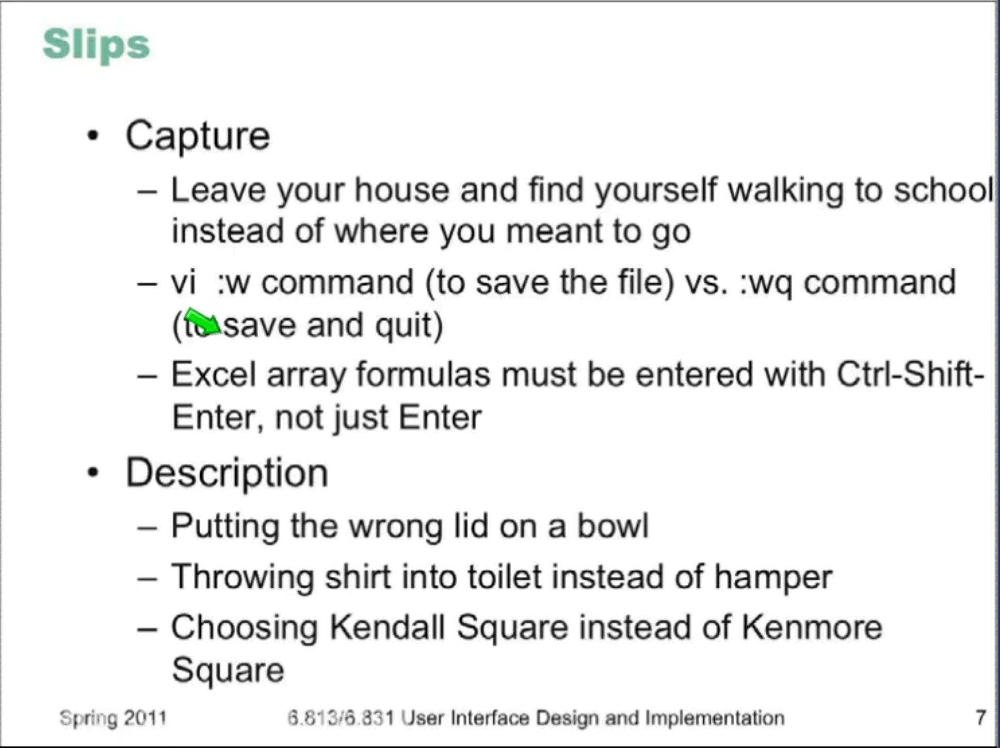
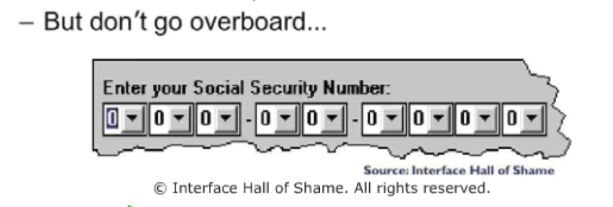
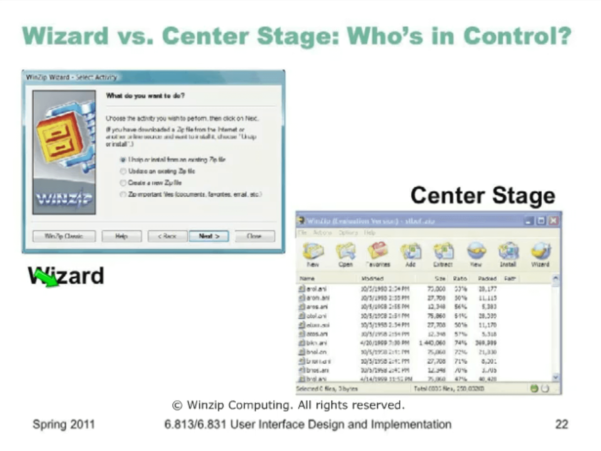
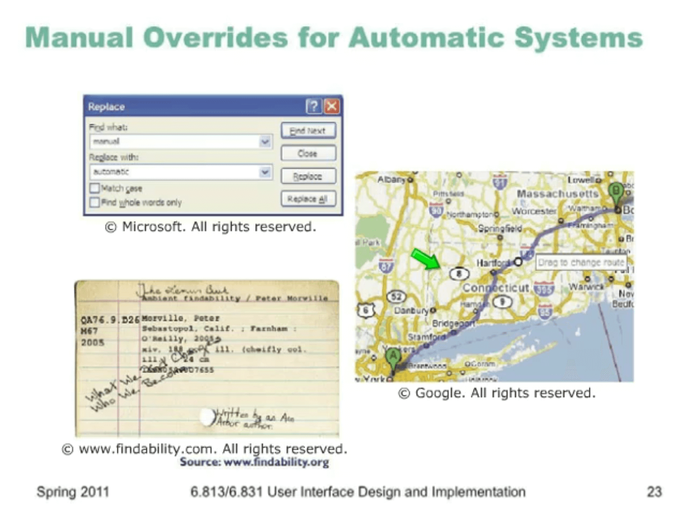
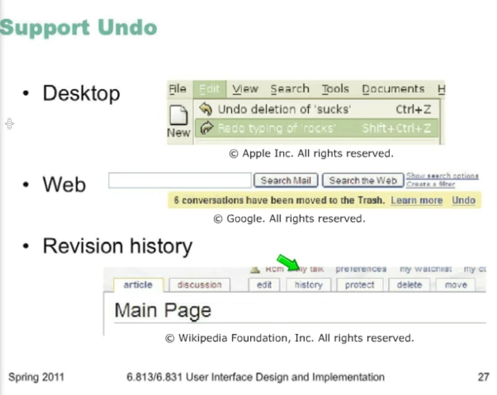
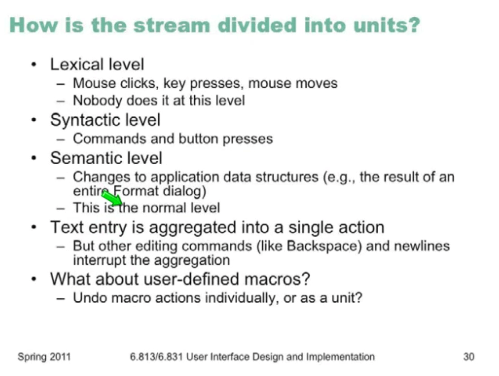
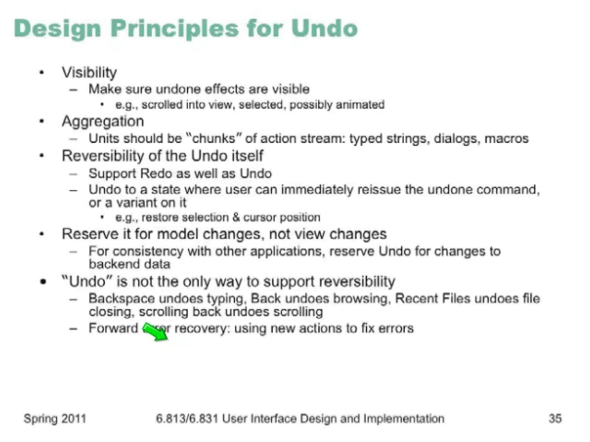
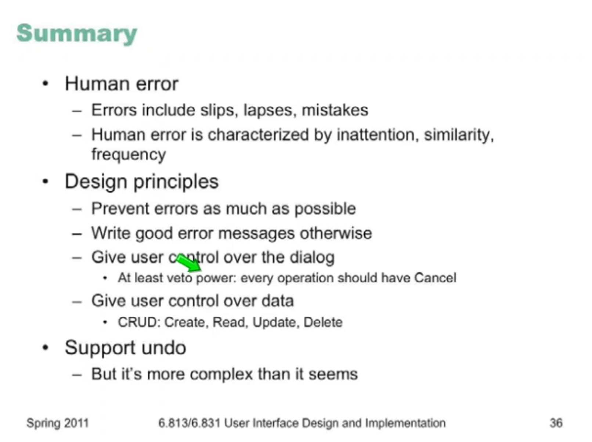

# Lecture 5 - Errors and Controls 

## Human Error

in cognitive sciences two types of error

1. Slips and lapses

   - failure to correctly execute a procedure
   - slip is a failure of execution, lapse is a failure of memory
   - typically found in skilled behavior

2. Mistakes

   - using wrong procedure for the goal
   - typically found in rule-based behavior or problem solving behavior

   60 percent are all flaws are originated from slips and lapses.

**Slips** are distinguished from lapses by the source of the failure. A slip is a failure of execution or control – for example, substituting one action for another one in the procedure.

 A **lapse** is a failure of memory – for example, forgetting the overall goal, or forgetting where you are in the procedure.

 A **mistake**, on the other hand, is an error made in planning or rule application

### Slips

### Lapses

- Loss of intentions = forget why you enter the room
- Omission due to interruption = interruption by phone call for example
- Already Satisfied Goal = ATM card thrower. 

slips and lapse are occurred because of loss of intention and similarity ion actions.

when we get skilled in an action, our focus will get thinner. 

## Mode Error

states in which actions have different meaning = due to low visibility of mode. (typing wq in Vi document instead of Vi command, Caps lock)

## Design Principles

### Error Prevention

#### avoiding slips and lapses

change appearance of different actions ( keep dangerous commands away from other commands)

#### Avoiding mode Error

- increase visibility
- eliminate modes
- spring-loaded or temp modes (like shift key)
- disjoint actin sets

#### Avoiding Lapses

- keep procedures short (atomic functions)
- minimize interruptions
- force functions

#### Other rules for errors

- disable illegal commands
- use menus and forms in contrast of cli (you can not make typos in predefined menus)

### Error Messages

#### Confirmation dialogs

it can confirm and it is necessary, but it can also UI tedious

#### Writing good error messages

- Best error messages is none at all
- error should be prevented 

#### Precise and comprehensible 

- Be precise with the error
- Restate user's input (cannot open file vs cannot open file x.docx)
- speak user's language
- give constructive help (why it happened, how to resolve it)
- non blaming and polite 

### User control & freedom

- learning by exploring
- dealing with error
- user is sentient, computer is not

#### Clearly marked exits

- long operation should have a cancel button
- all operations should have a cancel button

infrequent complex operations can be implemented with wizards. 

a good wizard should be reversible

google map lets you drag the route and re route it. 

#### Never ask me again

a tick box can be very efficient. but it should be reversible  

 ### User Control over data

- data entered by user should be editable
- UI should give CRUD data

## Undo

- undo reverses the effect of an action
- Q?
  - what streams of actions?
  - how far we can go back ?
  - etc. 

 

