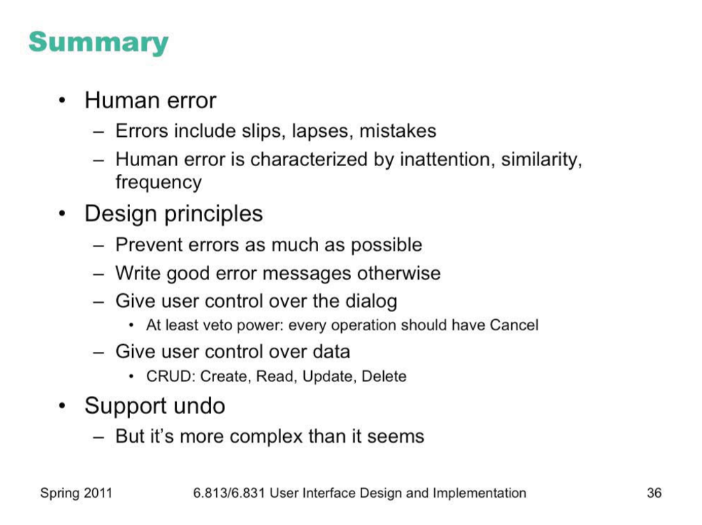

# Lecture 5 

**Slips** are distinguished from lapses by the source of the failure. A slip is a failure of execution or control – for example, substituting one action for another one in the procedure.

 A **lapse** is a failure of memory – for example, forgetting the overall goal, or forgetting where you are in the procedure.

 A **mistake**, on the other hand, is an error made in planning or rule application

