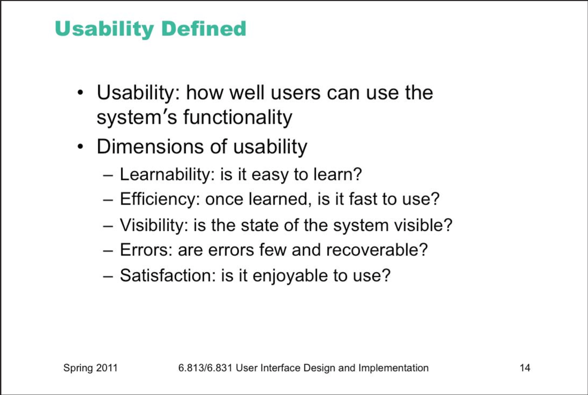
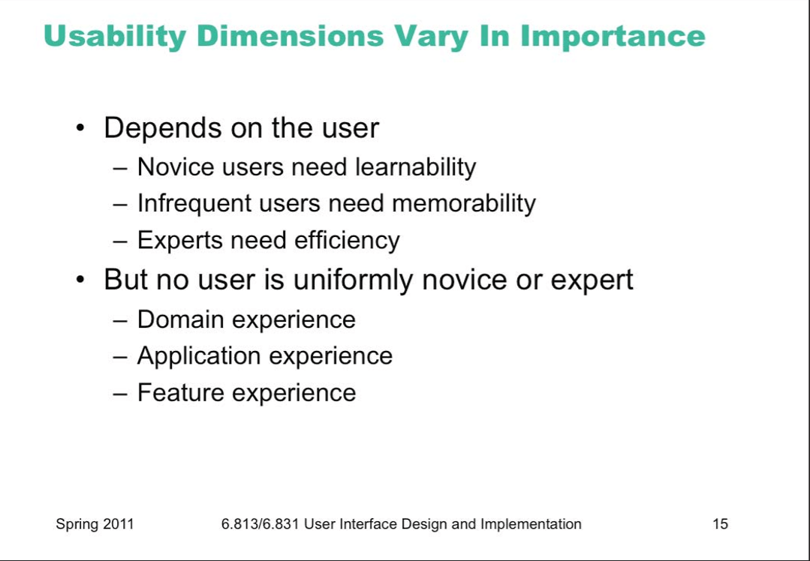
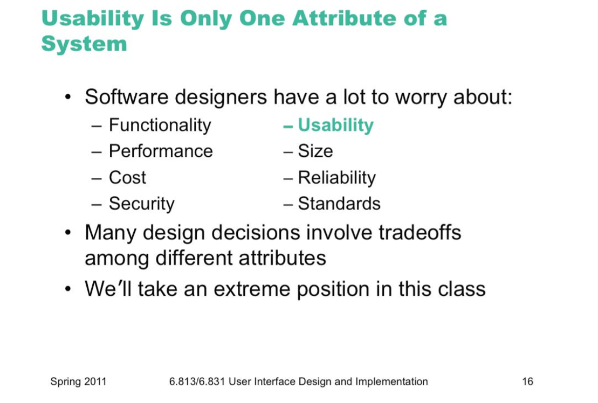

# Lecture1: Usability

## hall of shame: certificate selector

no help, mouse driven, inconsistency with other apps. no shortcut, can not remember where was the certificate. press okay. 

## hall of shame Set time

a constant text box + clock = clock is 12 hour time but text is 24 hour

## hall of shame GIMP

Menu file bar is not shown at top. you should click on it. different modes are confusing. shortcut handling in modes are bizarre.

they given us too much rope. 

## hall of fame/shame emacs

- pros : emacs: responsive. feedback. etc. 

- cons: are controls are invisible

## Hall of fame Microsoft clip

human friendly, abstract. 

## Why UI matters?

- Usable software sells good! users blame themselves. 

- users time is getting expensive. bad UI even kills people in X rays. 

- USS navy shot Iranian airplane. 

- UAV crashed because of UI

- usability is communication with end users. 

- google 30 elements in page was worse than 10 per page. 

we can quantize these metrics

Usability doesn’t exist in isolation, of course, and it may not even be the most important property of some systems.  Astronauts may care more about reliability of their navigation computer than its usability; military systems would rather be secure than easy to log into.  Ideally these should be false dichotomies: we’d rather have systems that are reliable, secure, and usable.  But in the real world, development resources are finite, and tradeoffs must be made