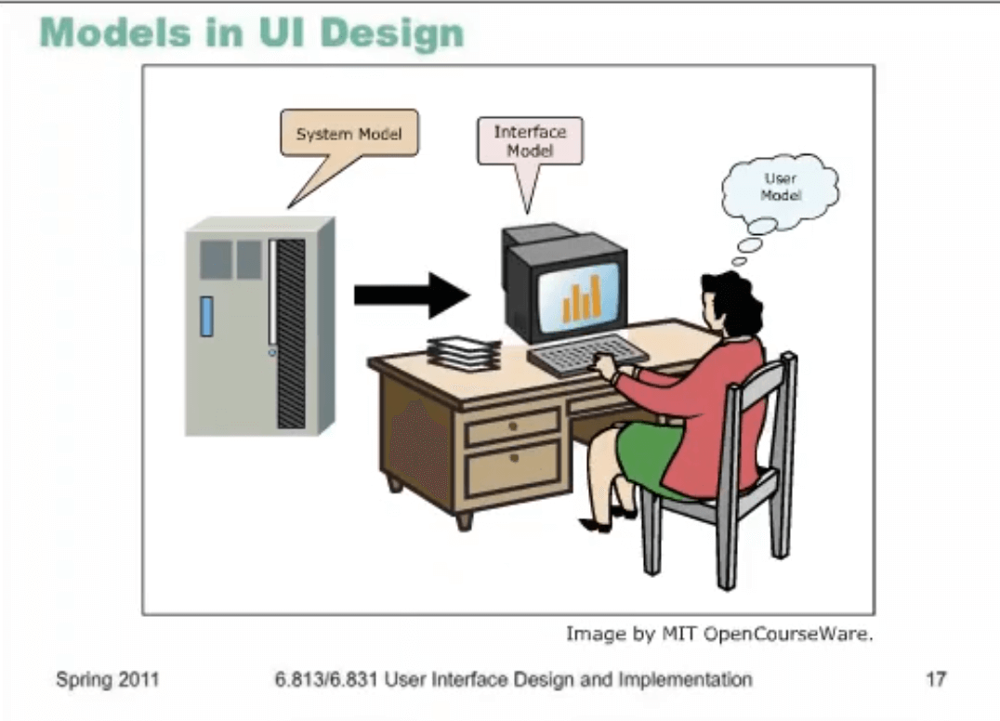

# Lec2 - Learnability

- Real CD = metaphor of CD 
- logo is static and does not have functionality (do not have action and misuse of space)
- CD is a holder. can not play by it self
- can not repeat 
- scroll bar is not learnable 
- volume 
- can not see all of tracks
- does not have consistency with other apps
- metaphor is not the only way to have a good UI. beautifulness is not a good metric for a good UI
- good design =! good functionality 

## Learnability 

can be learned for new user. we are designing for humans so we should learn about how human learns. we should not rely too much on human memory.

memorability and learnability are to important terms. 

## Memory  p.7

- working memory = 7+-2 chunks , 10 sec, 
- long term memory = infinite size and duration , from chunks to Long Term Memory

we can memorize with chaining info together with relationships

chunk = unit of perception 

example of chess. with using principles and rules and grammars we can memorize better. 

## Recognition vs Recall p.9

- recognition remembering with a cue
- recall means remembering with no help
- recognition is easier 

metaphor is used in recognition, (for example Recycle bin in windows)

## Gulf of execution and evaluation

1. **intention** (increase brightness) -> 
2. **planning** (menu, sub menu, brightness) ->
3.  **execution** (click on brightness) -> 
4. SYSTEM ->
5. **perception** (see the results) -> 
6. **interpret** (what does it saying?) -> 
7. **evaluation** (is it desired?)

**Better UI leads to faster cycle and escalated efficiency** 

## Interaction Styles

- Command language = the oldest interfaces. (Unix shell, search queries)
- Menus and Forms (Most of GUI are menu form)
- Direct Manipulation (new style. it will make a consistent visual representation)

Schneiderman, Designing UI, 2004:

1. **continuous Visual Representation** (folders and files in file explorer)
2. **Physical action** or Labeled Button presses. 
3. **rapid, incremental** (each incremental step should be visible) , **reversible** , **immediately visible** (unlike `cp` in Unix shell)

humans learned physical movement way before languages, so we can use physical actions more conveniently. 

## Comparison of Interaction Styles 

Command Language = CL, Menu Forms = MF and Direct Manipulation = DM

- Learnability :  Knowledge in the head vs world
  - CL needs a lot of knowledge
  - MF represent most of info with form 
  - DM uses metaphor an cues to increase learnability 
- Error Messages
  - CL and MF shows errors often, on the contrary DM uses error messages rarely. 
- Efficiency 
  - CL is more efficient (expert users)
  - MF can use shortcuts to increase efficiency 
  - DM less efficient 
- User Experience
  - CL for experts
  - MF and DM for novice users
- Synchrony : visible immediate reactions is **not** synchrony. look at it from pc POV. 
  - CL and MF are synchrony
  - DM is not, it is event driven
- Programming difficulty
  - CL < MF < DM
- Accessibility : for physically challenged people 
  - CL is not good 
  - MF is fine
  - DM can be really helpful

## Models P.16

user makes a mental model of how system works. model of a system is the behavior of the app.  model is a way to represent the app's functionality. 

- gimp & photoshop = pixel editing 
- vision = vector editing

has constraints & abilities. 

- text editor = text as a strings
- ed = text as characters 

## Models in UI

- System model (implementation model) : how system actually works
- Interfaces (manifest model): system is presented through interface
- user model (conceptual model) : how the user thinks of the system. 

System model represents how MVC would work, Interface model will represent how the a class object would work

interface has less functionality comparing the system model. we follow this notion for the sake of simplicity. 

## User model may be wrong

Common stereotype is that plugging the electricity will power on the machine. (like hose and water)

This wrong model is a good metaphor and end user can understand it well. 

thermostat is not presenting well and can not get good feedback. 

back button in browser is using a sequence of previous pages to go back. 

previous and back button are different (it is fixed now)

## Learnability Principles

affordance = a) give a cue b) implies a functionality. chair affords sitting. 

how to represent system model: 

we should have consistency between different models.

an interface model can communicate nonverbally with affordance. 

perceived affordance can be different with actual affordance. but they should be similar.  

## Natural Mapping

mapping functions to controls. we sometimes cannot have natural mapping. 

window controller in cars. 

## Visibility

if a user can not see a button, user should recall it or guess it. and that is bad. 

we should make every thing visible. for example we should visible the function of dragging and dropping.  we should represent draggable object (with wiggling for example)

## Feed Back 

​	action should have immediate visible. (sound, vibrate, image)

you should feedback in the middle of action and at the end of the action 

## Consistency

Principle of least surprise.  (similar things should act similar)

kinds of consistency:

- internal within the app
- external with other apps in the platform
- metaphorical with interface metaphor or with similar real objects

## Consistency of layout

tab menus are in above. and buttons should be consistent with with our preconceptions

## Consistency in words

share price, stock price, are similar 

## speak the user's language

do not use technical terms. use the user language. the same jargon and same terminology. 

on the other hand when designing a expert system, we should use expert jargons. 

## follow platform standards

- apple human interface guidelines
- window vista user experience
- GNOME // // 
- KDE UI Guidelines
- ...

in windows apps we should have files tab. 

## Metaphors 

metaphors can limit the ability of apps. 

