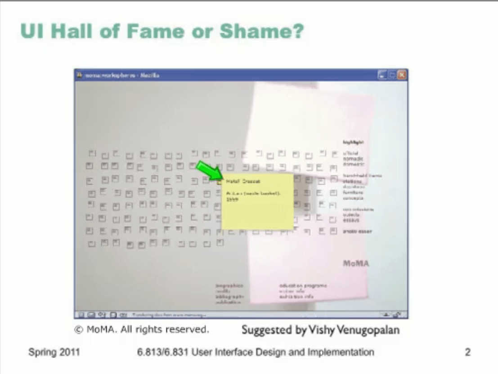
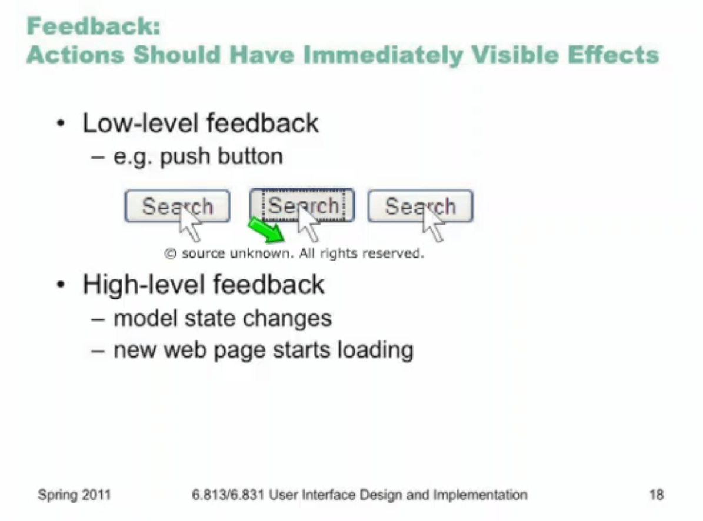

# Lecture 3: Visibility

## Flash driven website for art museum

pros:

- simplicity
- metaphor
- grouping in subjects

cons:

- icons are indistinguishible
- you should remember place of the object(recall)
- doesn't have visibility

## MOVADO clock brand

pros:

- beautiful 
- animations

cons:

- too much animation (2 sec per transition)
- invisible menus 

**Flash Animation** is not that bad. 

beautiful is can not contribute to the usability. 

## Topics

-  Visible actions
  - information scent
- Visible state
  - locus of attention
- Visible feedback
  - perceptual fusion
  - response time

### Visible actions

if we don't have visibility:

1. user should guess the controller existence
2. and guess where is it

we should increase Visibility

cues are important 

pulldown menus all of the commands are visible. Menu Bar is visible 

self - disclosure ( one line help ) = increase visibility.  

we should help user to find the info with info scent! 

we should spread the scent of info with cues and affordance. 

printer config was frequent in windows XP control panel. 

"Tools" is a general jargon and does give you any thing good. 

localization jargon is worse than Time, Date, region etc. 

## Modes

state in witch action have different meanings

modes will help to compress keys. 

error mode, make modes visible. 

psychology says we can focus on one thing. 

UI should navigate user's attention

## Visible Navigation State

visualize MVC in your mind

## Visible Model State

an approach is to show all of the controls. another approach is do simplicity and this can help with attention navigation too.

**this represent the state of interaction with interface**

## Complex  state

what elements should we present to the users. 

## perception fusion

too much feed back is not satisfactory. 

feedback can be all kind of types

visibility support learnability 

too much visibility is in conflict with simplicity 