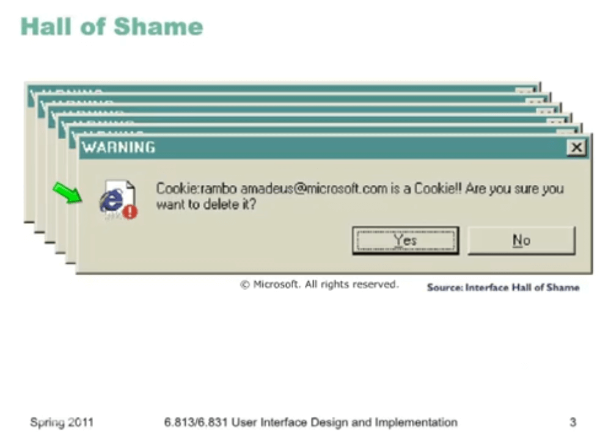
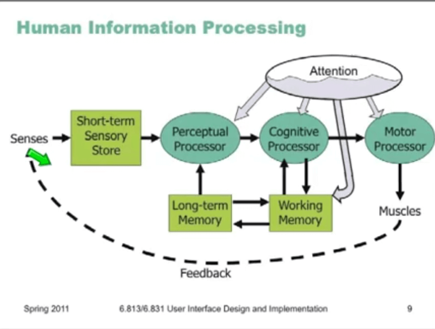
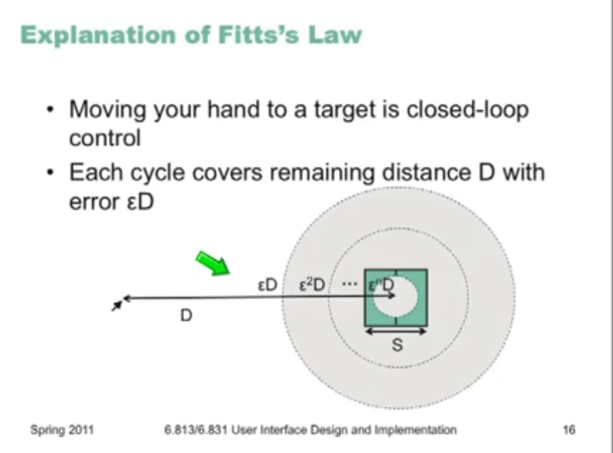
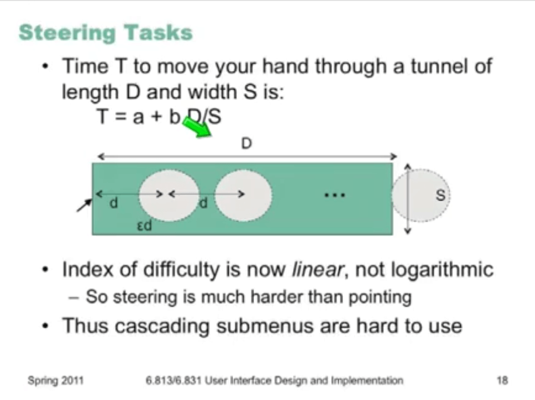
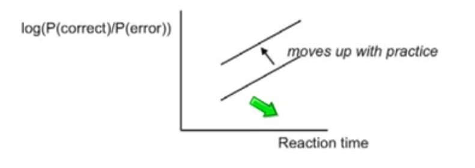
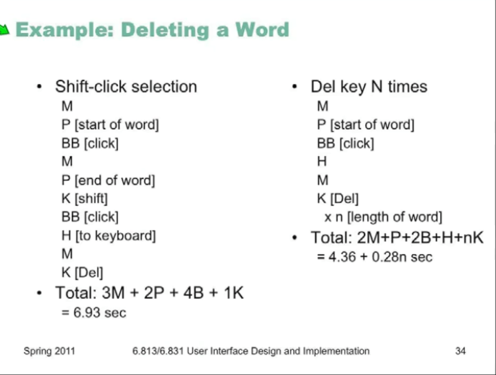
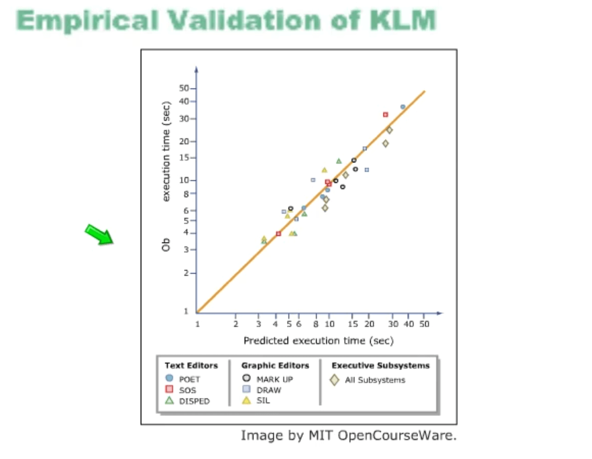
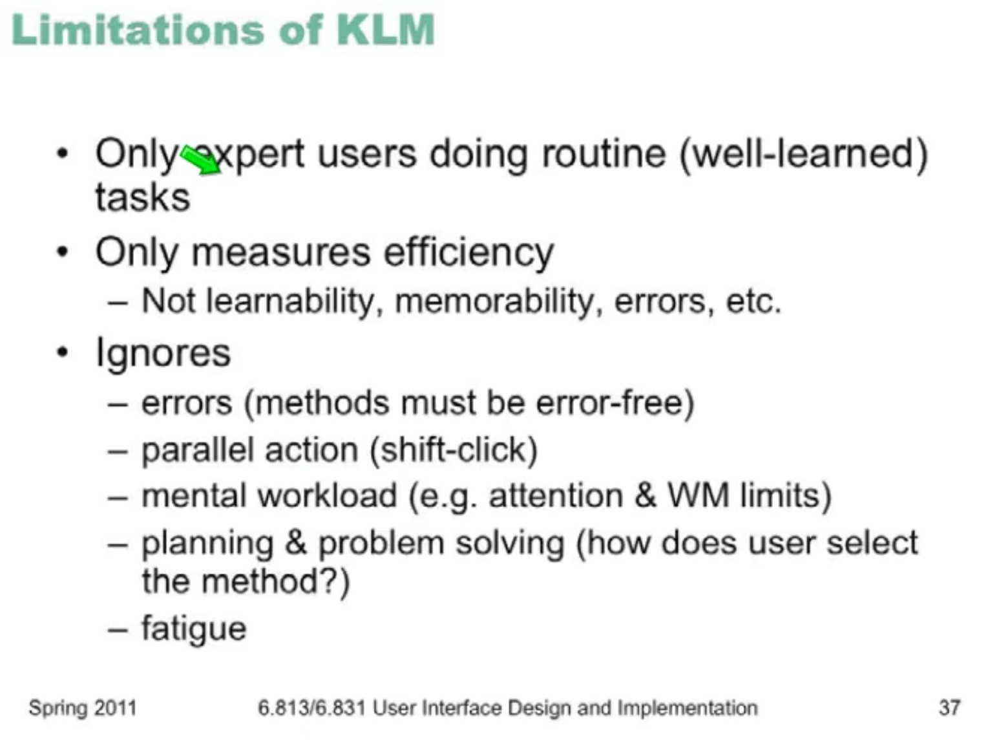
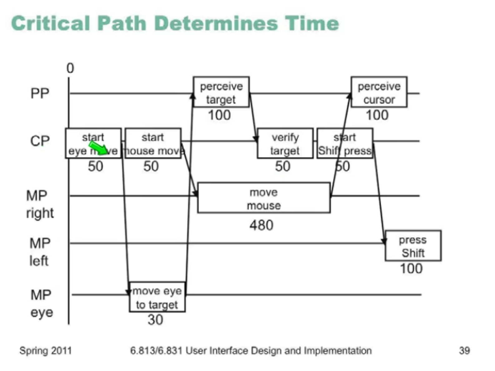
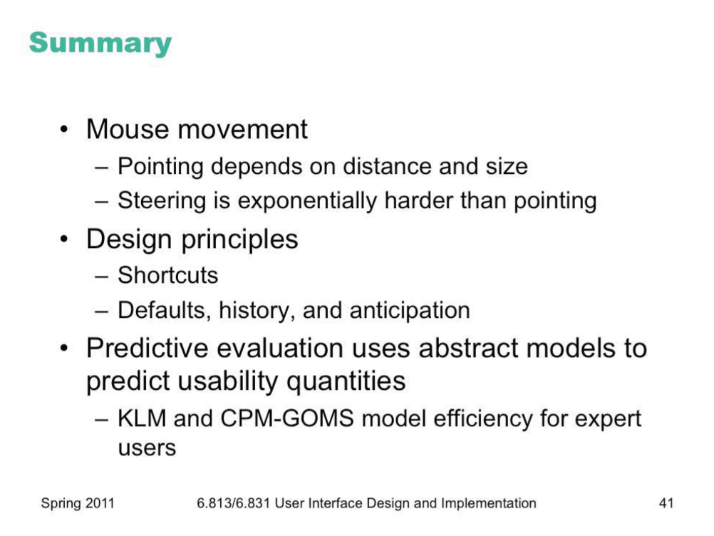

# Lecture 4 : Efficiency

## Hall of fame/shame

Yes to all? yes to all? no to all? 

when giving too much options to users, we are decreasing efficiency

we can have bottle neck in performance in UI. 

## Human information processing (HP)

we see, goes to short term memory, perceptual (with help of long term memory) -> cognition (new symbols goes to working memory) -> decision -> motor processor 

- perceptual processor = 50 - 200
- cognitive processor = 30 -100
- motor processor = 25 - 170

skilled tasks can make this time less, it is different for every human.

### Perceptual fusion 

frames **less than 100 ms** are fused together because we can **not distinguish** two frames. 

**causality** can be interpreted for perceptual fusion 

### Cognitive processing

- compares stimuli
- selects a response 

3 types if decision making

1. skill based = , can be achieved with repetition, minimum attention, can occur automatically 
2. rule based = in consciousness. defined by a rule. if this then that. 
3. knowledge base = unexpected event. needs a lot of attention. 

in UI we want to harness the skill based tasks. 

### Motor processing

- open loop = just motor processor, we don't care about feedback. 
- closed loop = need a cognition, need a feedback, need more time. TP + TC + TM

## Pointing efficiency 

### Choice reaction time

n stimuli, probably of them are same. different decision making time. 

### Fitt's Law

time T to move your hand to a target if size S at distance D away is :

T = Reaction T + Motor T = a + b log(D/S + 1)

#### Implication of Fitt's law

targets at screen edge are easy to hit 

linear popup vs pie menu (pie menu are 20% faster)

we don't have external consistency for pie menus 

When S is little, we make more errors.

### Speed accuracy Trade off

skill based can done faster with practice. 

- accuracy varies with reaction
  - here, accuracy is probability of lipase 

### Power Law of practice

Time Tn to do a task the nth time is:

**Tn = T1 n ^ - alpha**

alpha is typically 0.2 - 0.6

### Improves Mouse Efficiency

- make frequently used targets big
- put target used to ether near each other 
- use screen corners
- avoid steering tasks

## Design principles for Efficiency

- Shortcuts = Keyboard commands , careful about important actions (they should not be so accessible), grouping shortcuts together (Words Styles,), Scripts and etc.. 
- **Defaults** = auto complete boxes and, **history** = history of files for easy access. 
- anticipation = we predict that what user needs and give it to him/her when he needs it. (preview, new folder, CRUD, etc.)

## Predicting Efficiency 

engineering mpdel is 

- abstract
- quantitative
- approximate
- estimated from user experience

### pros:

- don't need to build UI prototype

- don't have to test real live users

- theory provides explanations ( reaveal the problesm do not explain them)

### Keystrokes level Model

- Keystrokes ( KOKAB )
- Button press (BUTTOON RO BARDASHT)
- Point with mouse (PART KARD SAMTE)
- draw line mouse (DAVID)
- Home hands between mouse and keyboard (HALAKESH KARD)
- mentally prepare (MORD!)

we have keyboard only process, mouse only and combined. 

Mental time calculated as 1.2 s with experiment in tasks. 

### predicted time vs KLM

### CPM - GOMS

- parallel 
- looks like Human processing model

Phone company examples:

they used KLM and thought they will save 1 sec on call. but they were wrong and CPM - GOMS told why 

## Summary

