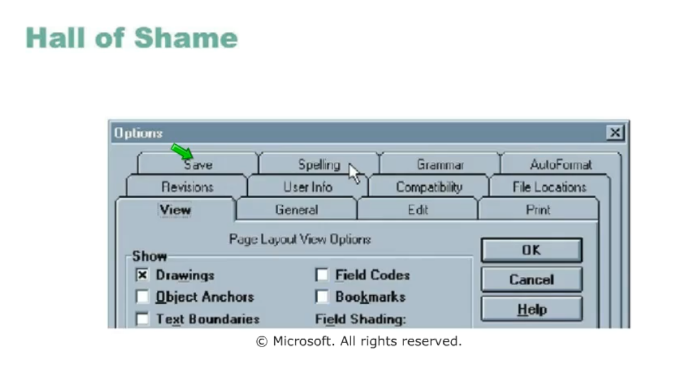
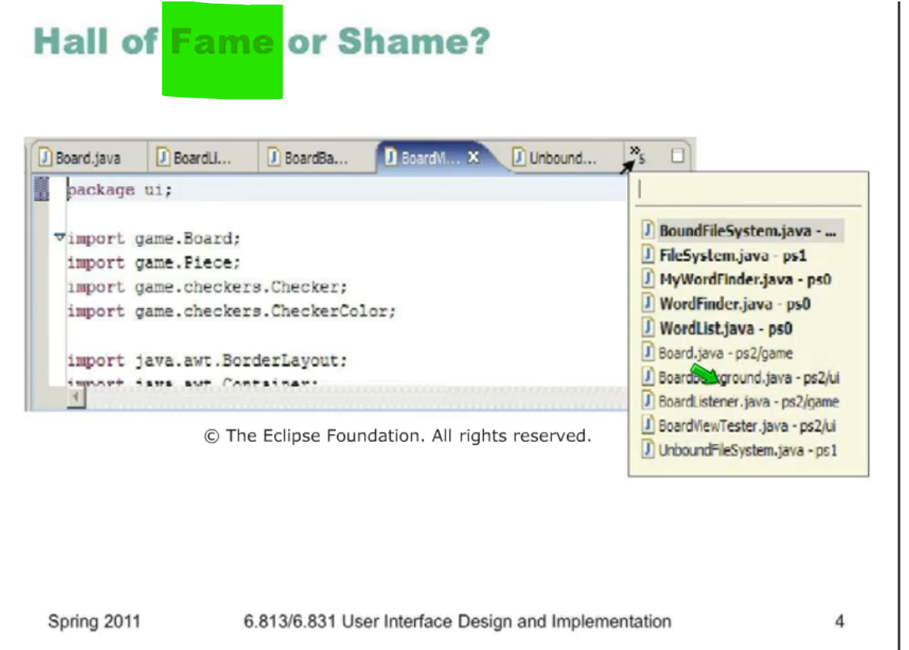
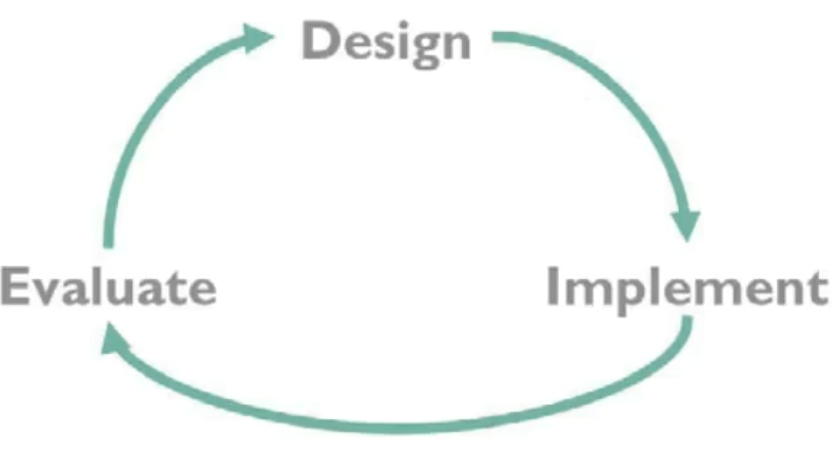

# lec6

Mozilla Fire Fox Tabs

pros:

- bookmark frequent pages

cons:

- can open more than 10 -15 (tabs will be too small)

## Topics

- iterative design
- user centered user design

## Iterative Design

